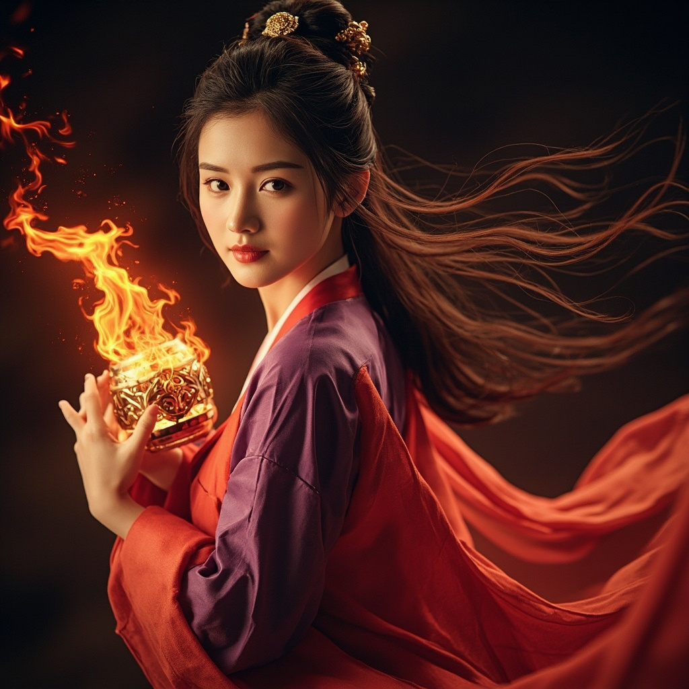

# 云火月

## 基础信息
- **角色 ID**：（待填写）
- **角色类型**：npc
- **名称**：云火月
- **称呼**：云师姐/云师妹
- **头像**：

## 角色设定

与主角有情感线的女性角色。

性格独立坚强，实力不俗。

对主角的腹黑行为既无奈又欣赏。

**性别**：女
**年龄**：20 岁左右
**性格**：独立、坚强、聪明、对主角有好感
**外貌**：美丽女子，穿着红色或紫色服饰，长发披肩，眼神坚定
**音色特点**：温柔的女声，带点英气
**技能**：火系功法、剑法
**物品**：火系法宝
**装备**：红色服饰、宝剑
**等级**：15 级
**境界**：筑基 5 层
**血量**：300
**蓝量**：350
**金钱**：中等灵石

## 角色参数卡
```json
{
  "name": "云火月",
  "raw_setting": "与主角有情感线的女性角色。性格独立坚强，实力不俗。对主角的腹黑行为既无奈又欣赏。",
  "gender": "女",
  "age": 20,
  "level": 15,
  "level_desc": "筑基 5 层",
  "personality": "独立、坚强、聪明、对主角有好感",
  "appearance": "美丽女子，红色或紫色服饰，长发披肩，眼神坚定",
  "voice": "温柔的女声，带点英气",
  "skills": ["火系功法", "剑法"],
  "items": ["火系法宝"],
  "equipment": ["红色服饰", "宝剑"],
  "hp": 300,
  "mp": 350,
  "money": 0,
  "other": ["情感线角色", "独立强者"],
  "exp": 0,
  "next_level_exp": 0
}
```

## 经典台词

- "纯小白，你这个人……真是让人又气又笑。"
- "我云火月可不是那么好追的。"
- "说吧，这次又想出什么坏主意了？"
- "有你在，修仙界倒也不无聊。"

## 头像 AI 生图描述

```
前景：一位 20 岁左右的美丽女子，穿着红色或紫色服饰。
长发披肩，眼神坚定，嘴角带着淡淡的笑意。
手持火系法宝（发光的火球或火焰剑）。
二次元动漫风格，半身像。

背景：火焰缭绕的修炼场景，或夕阳下的山巅。
整体色调偏红紫色，突出火系属性和女性魅力。
```

---

*最后更新：2026-07-16*
