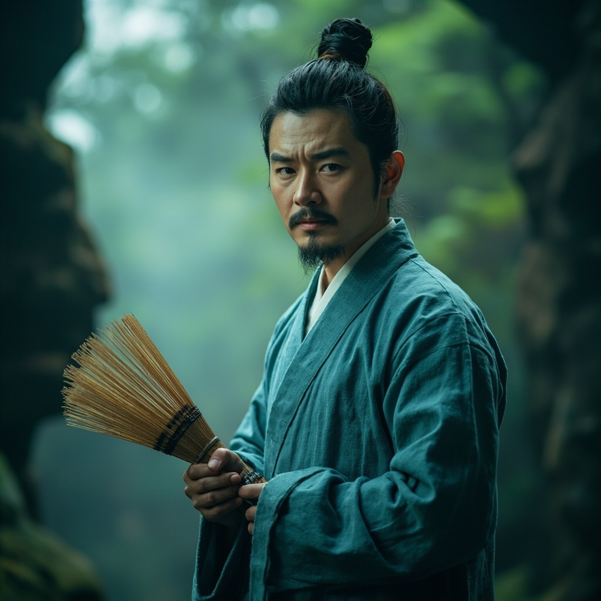

# 李玄风

## 基础信息
- **角色 ID**：（待在 Toonflow 后台创建后填入）
- **角色类型**：npc
- **名称**：李玄风
- **头像**：

## 角色设定

稳健型修仙者，主角早期的引路人。

在主角被丢入修仙界后相遇，指引他修炼之路。

性格谨慎，与主角的腹黑风格形成对比。

**性别**：男
**年龄**：30 岁左右
**性格**：稳健、谨慎、热心
**外貌**：中年男子，穿着朴素道袍，面容和善
**音色特点**：沉稳的中年男声
**技能**：《青云诀》、基础仙法
**物品**：修炼丹药若干
**装备**：道袍、飞剑
**等级**：15 级
**境界**：筑基 5 层
**血量**：300（基础 100 + 等级×10，假设筑基期=20 级）
**蓝量**：300
**金钱**：若干灵石

## 角色参数卡
```json
{
  "name": "李玄风",
  "raw_setting": "稳健型修仙者，主角早期引路人。在主角被丢入修仙界后相遇，指引修炼之路。性格谨慎，与主角腹黑风格形成对比。",
  "gender": "男",
  "age": 30,
  "level": 15,
  "level_desc": "筑基 5 层",
  "personality": "稳健、谨慎、热心",
  "appearance": "中年男子，朴素道袍，面容和善",
  "voice": "沉稳的中年男声",
  "skills": ["青云诀", "基础仙法"],
  "items": ["修炼丹药"],
  "equipment": ["道袍", "飞剑"],
  "hp": 300,
  "mp": 300,
  "money": 0,
  "other": ["主角引路人", "稳健型修士"],
  "exp": 0,
  "next_level_exp": 0
}
```

## 经典台词

- "小友，修仙之路需谨慎。"
- "老夫看你骨骼惊奇，可愿拜入我门下？"
- "切记，不可像你那般……呃，行事风格。"
- "修仙界险恶，小友保重。"

## 头像 (ai 生图形象描述)

- **前景**：一位 30 岁左右的中年男子，穿着朴素青色道袍，手持拂尘。面容和善，眼神睿智，留着短须。站姿端正，气质沉稳。二次元动漫风格，半身像。
- **背景**：修仙界洞府外景，有青松、云雾、仙鹤等元素，突出修仙者氛围。整体色调偏青绿色，突出道家风范。

---

*最后更新：2026-07-16*
