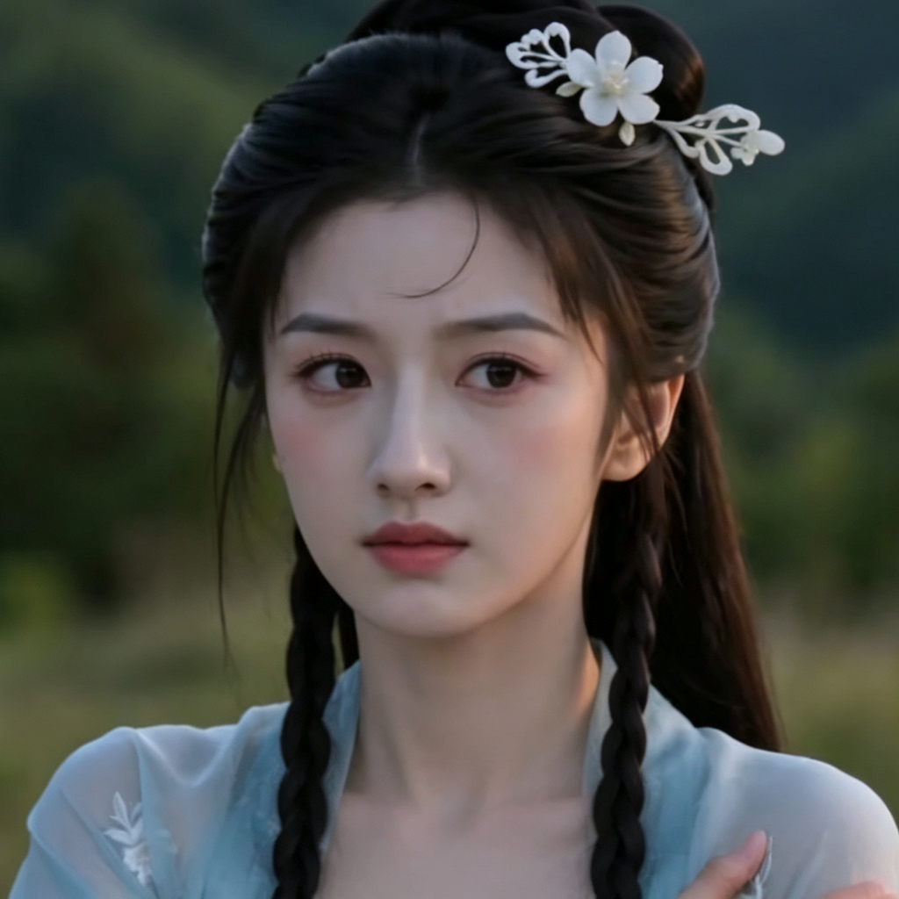

# 白锦儿（白师妹）

## 基础信息
- **角色 ID**：（待填写）
- **角色类型**：npc
- **名称**：白锦儿
- **称呼**：白师妹
- **头像**：

## 角色设定

同门师妹，被主角"拉下水"一起干坏事。

与主角关系暧昧，是早期重要女性角色。

性格天真活泼，但被主角带偏后也开始搞些小套路。

**性别**：女
**年龄**：18 岁左右
**性格**：天真活泼、善良、容易被带偏、对主角有好感
**外貌**：清秀少女，穿着青色宗门服饰，扎着双马尾
**音色特点**：清脆的少女声，活泼可爱
**技能**：基础剑法、宗门功法
**物品**：宗门令牌、零食若干
**装备**：青钢剑、宗门服饰
**等级**：3 级
**境界**：炼气 3 层
**血量**：130
**蓝量**：130
**金钱**：少量灵石

## 角色参数卡
```json
{
  "name": "白锦儿",
  "raw_setting": "同门师妹，被主角拉下水一起干坏事。天真活泼，善良，容易被带偏，对主角有好感。",
  "gender": "女",
  "age": 18,
  "level": 3,
  "level_desc": "炼气 3 层",
  "personality": "天真活泼、善良、容易被带偏",
  "appearance": "清秀少女，青色宗门服饰，双马尾",
  "voice": "清脆的少女声，活泼可爱",
  "skills": ["基础剑法", "宗门功法"],
  "items": ["宗门令牌", "零食"],
  "equipment": ["青钢剑", "宗门服饰"],
  "hp": 130,
  "mp": 130,
  "money": 0,
  "other": ["主角师妹", "暧昧对象"],
  "exp": 0,
  "next_level_exp": 300
}
```

## 经典台词

- "师兄，这样真的好吗？……不过听起来好有趣！"
- "我就知道师兄最厉害了！"
- "师兄，今天我们去……那个？"
- "谁敢欺负我师兄，先问问我手中的剑！"

## 头像 AI 生图描述

```
前景：一位 18 岁左右的清秀少女，穿着青色宗门服饰，扎着双马尾。
大眼睛，笑容甜美，脸颊微红。手持青钢剑，剑穗飘动。
二次元动漫风格，半身像。

背景：宗门练武场，有青松、石阶、其他弟子练剑的模糊身影。
整体色调偏青绿色，青春活力氛围。
```

---

*最后更新：2026-07-16*
