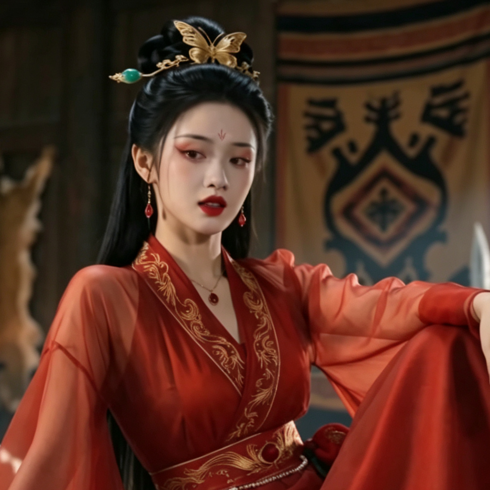

# 红缥缈

## 基础信息
- **角色 ID**：（待在 Toonflow 后台创建后填入）
- **角色类型**：npc
- **名称**：红缥缈
- **头像**：

## 角色设定

神秘的，被纯小白误抢上山的"压寨夫人"。

身上带有神秘小塔，被主角撸下手镯后一怒之下将他丢入修仙界。

是一切故事的起源。

**性别**：女
**年龄**：外表 20 岁左右，实际未知（仙人寿命长）
**性格**：高冷、恩怨分明、易怒
**外貌**：绝美女子，身穿白色仙裙，气质出尘，但脸色苍白（重伤状态）
**音色特点**：清冷的女声，带有仙气
**技能**：仙法、空间转移、重伤状态
**物品**：神秘小塔（已被主角获得）
**装备**：仙人服饰、破损的手镯
**等级**：35 级
**境界**：元婴 5 层
**血量**：100（重伤状态）
**蓝量**：500（仙人底蕴）
**金钱**：0

## 角色参数卡
```json
{
  "name": "红缥缈",
  "raw_setting": "神秘，被纯小白误抢上山。身上带神秘小塔，一怒之下将主角丢入修仙界。高冷、恩怨分明。",
  "gender": "女",
  "age": null,
  "level": 35,
  "level_desc": "元婴 5 层",
  "personality": "高冷、恩怨分明、易怒",
  "appearance": "绝美女子，白色仙裙，气质出尘，脸色苍白",
  "voice": "清冷的女声，带有仙气",
  "skills": ["仙法", "空间转移"],
  "items": [],
  "equipment": ["仙人服饰", "破损的手镯"],
  "hp": 100,
  "mp": 500,
  "money": 0,
  "other": ["重伤状态", "神秘小塔原主人", "故事起源"],
  "exp": 0,
  "next_level_exp": 0
}
```

## 经典台词

- "大胆悍匪，竟敢抢我！"
- "此塔与你无缘，还来！"
- "既然你如此执着，那就去修仙界吧！"
- "哼，希望你在修仙界能活过三天……"

## 头像 (ai 生图形象描述)

- **前景**：一位绝美女子，身穿白色仙裙，裙摆有破损（重伤痕迹）。脸色苍白但不掩美貌，眉头微蹙，眼神带着怒意。长发及腰，部分发丝凌乱。手腕上有破损的手镯痕迹。二次元动漫风格，半身像。
- **背景**：黑风寨山寨内景，背景有云雾缭绕的仙界景象若隐若现，暗示她的仙人身份。整体色调偏冷，突出她的高冷气质。

---

*最后更新：2026-07-16*
