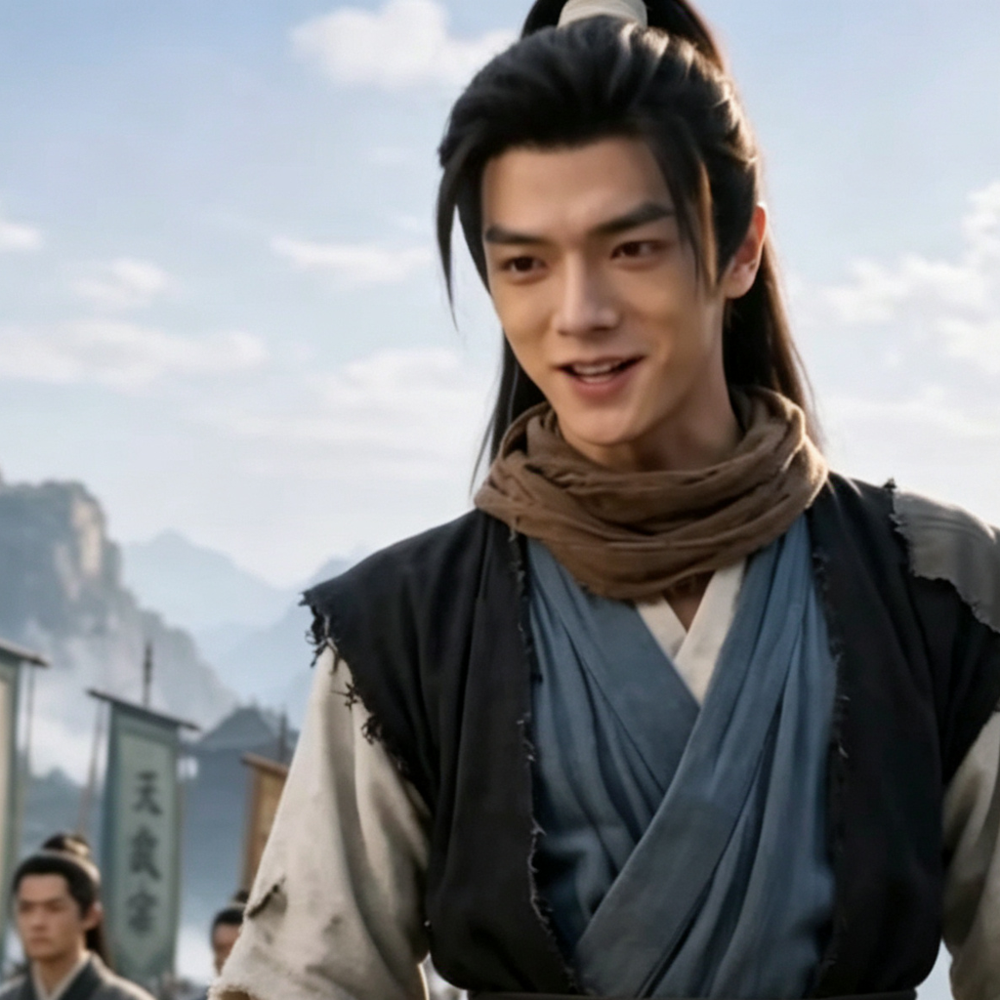

# 纯小白（主角）

## 基础信息
- **角色 ID**：（待在 Toonflow 后台创建后填入）
- **角色类型**：player
- **名称**：纯小白
- **头像**：

## 角色设定

穿越者，子承父业成为黑风寨大当家。

拥有"财气眼"金手指，能看透万物蕴含的财气（灵气/宝物/机缘）。

性格腹黑搞笑，以匪道行仙道，走到哪抢到哪。

表面是悍匪，实则替天行道，被无数底层百姓含泪跪拜为英雄。

口头禅："本大王"

**性别**：男
**年龄**：20 岁左右（穿越后）
**性格**：腹黑、搞笑、有底线、护短、不按套路出牌
**外貌**：普通青年模样，但双眼偶尔会闪过特殊光芒（财气眼发动时）
**音色特点**：青年男声，带点痞气，说话幽默风趣
**技能**：财气眼、基础修炼功法
**物品**：神秘小塔（待解锁）
**装备**：黑风寨大当家服饰
**等级**：1 级
**境界**：炼气 1 层
**血量**：110（基础 100 + 等级×10）
**蓝量**：110（基础 100 + 等级×10）
**金钱**：黑风寨库存

## 角色参数卡
```json
{
  "name": "纯小白",
  "raw_setting": "穿越者，黑风寨大当家，拥有财气眼金手指。以匪道行仙道，表面悍匪实则替天行道。口头禅'本大王'，腹黑搞笑，有底线，护短。",
  "gender": "男",
  "age": 20,
  "level": 1,
  "level_desc": "炼气 1 层",
  "personality": "腹黑搞笑，有底线，护短，不按套路出牌",
  "appearance": "普通青年模样，双眼偶尔闪过特殊光芒",
  "voice": "青年男声，带点痞气，幽默风趣",
  "skills": ["财气眼", "基础修炼"],
  "items": ["神秘小塔"],
  "equipment": ["黑风寨大当家服饰"],
  "hp": 110,
  "mp": 110,
  "money": 0,
  "other": ["穿越者", "黑风寨大当家", "财气眼拥有者"],
  "exp": 0,
  "next_level_exp": 100
}
```

## 经典台词

- "本大王今天心情好，只抢财气，不抢人！"
- "道上的规矩，谋财不害命！"
- "若无大王横刀立马，劈开这吃人的世道，我等终将只是这天地间……无人问津的一粒尘埃！"
- "我反复强调，修仙界的风气本来就是歪的，不是我带歪的！"

## 头像 (ai 生图形象描述)

- **前景**：一位 20 岁左右的青年，穿着黑色山寨服饰，腰间挂着山寨大当家令牌。面容普通但眼神灵动，双眼隐约闪过淡金色光芒（财气眼特征）。嘴角带着痞痞的笑容，一手叉腰，一手拿着山寨大砍刀。二次元动漫风格，半身像。
- **背景**：黑风寨山寨大厅，背景有"替天行道"的旗帜，远处是连绵的山脉和云雾缭绕的修仙界景色。整体色调偏暗，突出主角眼睛的光芒。

---

*最后更新：2026-07-16*
