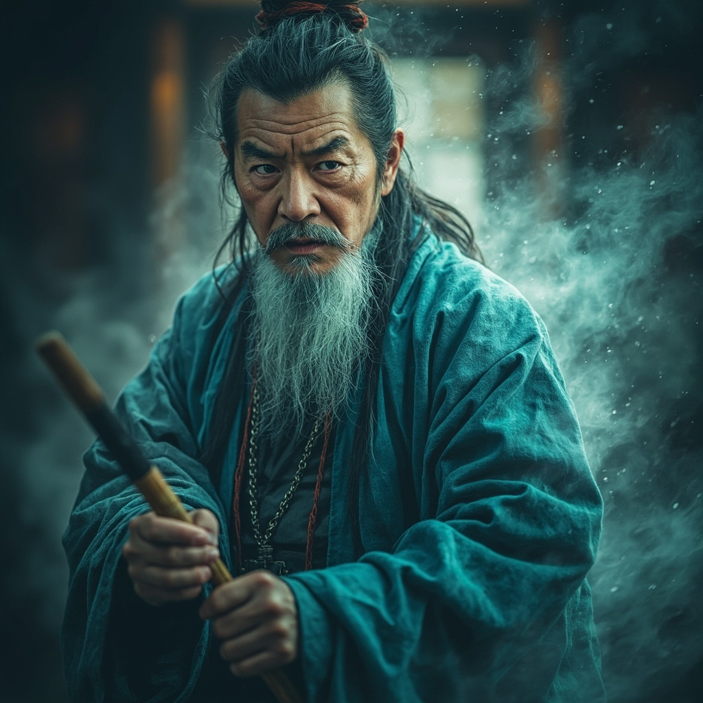

# 苍山道人

## 基础信息
- **角色 ID**：（待填写）
- **角色类型**：npc
- **名称**：苍山道人
- **称呼**：苍山前辈
- **头像**：

## 角色设定

后期登场的对手，第 260-308 章出现。

与殿主失踪阴谋相关。

实力强大，立场不明。

**性别**：男
**年龄**：60 岁左右
**性格**：神秘、强大、立场不明
**外貌**：老年男子，穿着青色道袍，面容严肃
**音色特点**：低沉的老年男声，有威严
**技能**：高阶功法、阵法、殿主权限
**物品**：殿主令牌、神秘宝物
**装备**：青色道袍、法宝
**等级**：55 级
**境界**：炼虚 5 层
**血量**：1000
**蓝量**：1000
**金钱**：未知

## 角色参数卡
```json
{
  "name": "苍山道人",
  "raw_setting": "后期登场的对手，第 260-308 章出现。与殿主失踪阴谋相关。实力强大，立场不明。",
  "gender": "男",
  "age": 60,
  "level": 55,
  "level_desc": "炼虚 5 层",
  "personality": "神秘、强大、立场不明",
  "appearance": "老年男子，青色道袍，面容严肃",
  "voice": "低沉的老年男声，有威严",
  "skills": ["高阶功法", "阵法", "殿主权限"],
  "items": ["殿主令牌", "神秘宝物"],
  "equipment": ["青色道袍", "法宝"],
  "hp": 1000,
  "mp": 1000,
  "money": 0,
  "other": ["后期反派", "殿主失踪阴谋", "实力强大"],
  "exp": 0,
  "next_level_exp": 0
}
```

## 经典台词

- "纯小白，有些事你不该查。"
- "殿主？哼……他已经消失了。"
- "年轻人，收手吧，这不是你能掺和的。"
- "既然你执意如此……那就别怪老夫了。"

## 头像 AI 生图描述

```
前景：一位 60 岁左右的老年男子，穿着青色道袍。
面容严肃，眼神深邃，留着长须。
手持拂尘或法宝，周身有灵气环绕。
二次元动漫风格，半身像。

背景：宗门大殿或秘境深处，有阵法、石柱等。
整体色调偏青灰色，突出神秘和威严。
```

---

*最后更新：2026-07-16*
