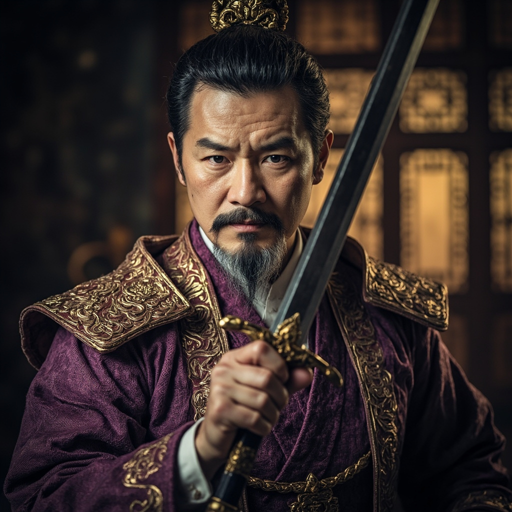

# 陆青山（陆长老）

## 基础信息
- **角色 ID**：（待填写）
- **角色类型**：npc
- **名称**：陆青山
- **称呼**：陆长老
- **头像**：

## 角色设定

主角出生入死的兄弟，核心盟友。

宗门长老，为人正直，被主角救过命。

在主角卷入栽赃陷害阴谋时，主角曾保护他。

**性别**：男
**年龄**：40 岁左右
**性格**：正直、重情义、果断、有担当
**外貌**：中年男子，穿着长老服饰，面容刚毅，留着短须
**音色特点**：洪亮的中年男声，有威严
**技能**：高阶剑法、长老权限、宗门阵法
**物品**：长老令牌、丹药若干
**装备**：长老服饰、宝剑
**等级**：25 级
**境界**：金丹 5 层
**血量**：500
**蓝量**：500
**金钱**：较多灵石

## 角色参数卡
```json
{
  "name": "陆青山",
  "raw_setting": "主角出生入死的兄弟，核心盟友。宗门长老，为人正直，被主角救过命。在主角卷入阴谋时，主角曾保护他。",
  "gender": "男",
  "age": 40,
  "level": 25,
  "level_desc": "金丹 5 层",
  "personality": "正直、重情义、果断、有担当",
  "appearance": "中年男子，长老服饰，面容刚毅，短须",
  "voice": "洪亮的中年男声，有威严",
  "skills": ["高阶剑法", "长老权限", "宗门阵法"],
  "items": ["长老令牌", "丹药"],
  "equipment": ["长老服饰", "宝剑"],
  "hp": 500,
  "mp": 500,
  "money": 0,
  "other": ["主角兄弟", "宗门长老", "生死之交"],
  "exp": 0,
  "next_level_exp": 0
}
```

## 经典台词

- "纯兄弟，这条命是你救的！"
- "我陆青山在此，谁敢动我兄弟！"
- "兄弟，有话直说，陆某赴汤蹈火！"
- "修仙界险恶，但兄弟情义永存！"

## 头像 AI 生图描述

```
前景：一位 40 岁左右的中年男子，穿着宗门长老服饰（紫色或金色）。
面容刚毅，眼神坚定，留着短须。站姿挺拔，气势威严。
手持宝剑，剑鞘华丽。二次元动漫风格，半身像。

背景：宗门大殿内景，有柱子、旗帜、其他长老的模糊身影。
整体色调偏紫金色，突出长老威严。
```

---

*最后更新：2026-07-16*
