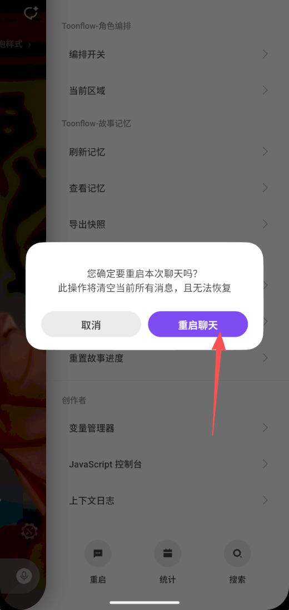

# 静态动态数据

重启：在挑“聊天”的 右上角的 “按钮” 点击- 重启-重启聊天。
javascript 控制台会出现 
```
[eruda-debug] injected into SELF iframe
[eruda-debug] plugin entry loaded
```
各种插件会重载。

重启聊天不会清除的数据就是静态数据。
包括 角色卡（静态），故事配置数据，章节内容，故事背景等

动态数据不断在游玩中发生变化的数据。
角色动态参数卡
故事各种动态数据

重启聊天也不会只是清除动态数据，而是重构动态数据。

参照toonflow game 进行设计。


#
  重点：tavo 文档说 chat scope 变量"重启聊天不会清除"——但 tavo_chat_reset 是个明确破坏性操作，不是"重启"。用户在手机上的"重启聊天"很可能是触发了 reset 按钮。

  怎么修：
  1. 数据不放在 chat scope（被 reset 干掉），改用**global scope**（全局永久）
  2. 数据多写一份到世界书 entry（也属于 lorebook，不受 chat_reset 影响）