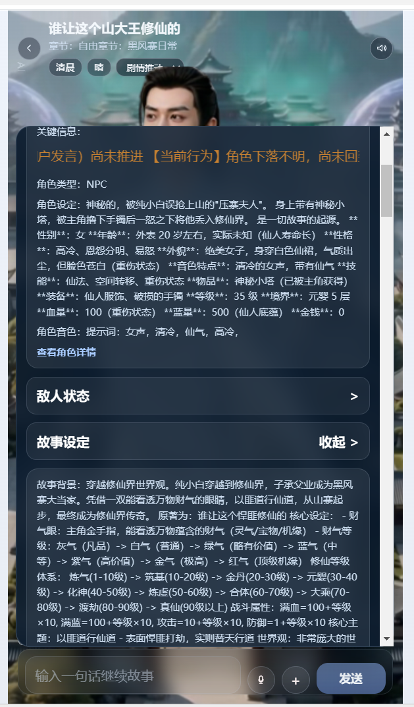
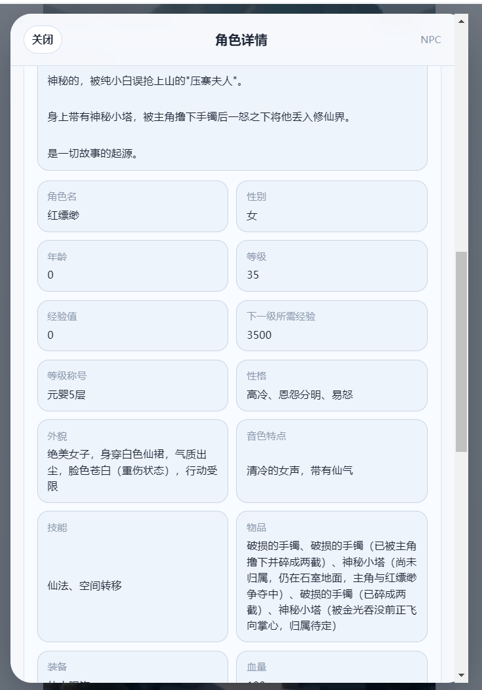

按钮有了，但是挺丑。像toonflow  就是底部  “{故事名} >” 点击展开 点击角色 可查看动态属性

触发器：聊天页底部一个紧凑的横条，左边是故事名，右边一个橙色 › 箭头（像 tavo 原生 tab 一样，不抢眼）
展开面板：全屏居中模态（不是侧抽屉），暗色圆角，分段清晰
角色列表：横排可滚动的圆形头像芯片 + 下方名字
角色详情：两栏键值卡（角色名/性别、年龄/等级、经验值/下一级所需经验 那种整齐的方块卡），跟截图 3 完全一致