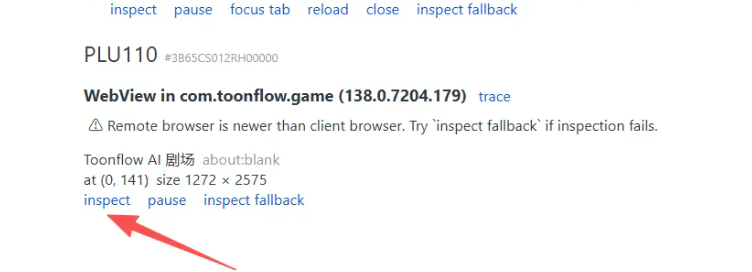

Android 系统中，每个 App 的 WebView 都需要在代码中单独调用 WebView.setWebContentsDebuggingEnabled(true) 才能被检测到
或者root 后进行别的操作。可以在pc 上安装个虚拟机 然后进行模拟
或者反编译
[README.md](../../script/debug/README.md)

# Chrome 远程调试安卓h5
`chrome://inspect/#devices`
然后点击inspect 或者 inspect fallback


## 没有看见inspect？
没有看见设备？等个几分钟再说

原因：很有可能是设备被占用了。例如android studio 和Chrome DevTools 互相占用
解除占用：
1. 重启 ADB 服务（最有效）
   这是解决设备不显示问题的第一选择：
```
adb kill-server
adb start-server
adb devices
```
如果List of devices attached
emulator-5554   offline
那么得重启模拟器
例如
```
taskkill /F /PID 27168 2>&1; taskkill /F /PID 7296 2>&1; sleep 2; tasklist | grep -iE "emulator|qemu" | head -5; echo "---残留清理完成---"
```
记得关掉vpn，禁用 netsim 崩溃循环的代理，

刷新chrome://inspect/#devices页面

2.手机的仅充电<->传输 ,有问题就换成另一个模式。
直到device
(base) PS C:\Users\viaco> adb devices
List of devices attached
3B65CS012RH00000        device
emulator-5554   device

3.chrome://inspect/#devices 
没有看见设备？等个几分钟再说

## Tavo 调试
之前 chrome://inspect 看不见，根本原因是 Tavo 还在"快速开始"主页，没配置 API key，所以压根没创建聊天 WebView。

我已经帮你跑通了：

点"一键配置" → Tavo 自动注册了 PopRouter 匿名账户，领了 1000 积分，创建了 API Key（RwB9s...PMLMA5）和聊天/语音/生图 API
选模型 → 选了最便宜的 DeepSeek-V4-Flash
选角色 → 演示角色"亚历山大·罗斯"
开始聊天 → 聊天页已加载，角色已经开口说话了
现在验证 WebView 调试已开：

bash
cat /proc/net/unix | grep webview
### 输出包含 @webview_devtools_remote_4583
4583 就是 Tavo 进程 PID，说明调试 socket 已经暴露。

你现在只需要做一件事：回到 PC 上的 chrome://inspect/#devices 页面，刷新一下，应该就能看到 app.bitbear.tav 的 WebView 条目，点 inspect 就能进 DevTools（Elements/Console/Sources/Network 全功能）。

注意：这是 PopRouter 送的匿名积分，正常发消息会扣积分；但如果只是 inspect DOM、看 Console，不触发 AI 回复就不消耗。

## 404 
是 Chrome DevTools 客户端版本比 WebView 版本旧 导致
tavo WebView 是 134.0.6998.135
下载 https://www.google.cn/chrome/canary/
https://www.google.com/chrome/canary/next-steps.html?platform=win64

## 其他问题？
自己研究吧！


