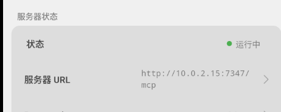
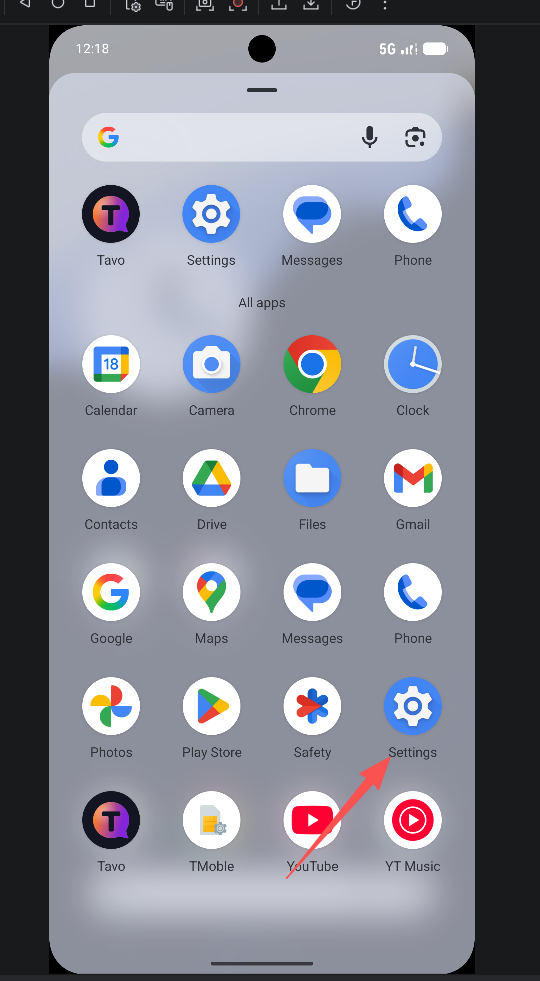

## avd 使用方法
### 安装 AVD:略
## 使用 sim
假设avd 是：Pixel_8_Pro
emulator -avd Pixel_8_Pro 
注意 不改分辨率缩放不了窗口
emulator -avd Pixel_8_Pro -scale 0.5 -skin 1080x1920

### 使用
怎么启动
获得 Android SDK 进行设置
``` 
set ANDROID_HOME="%LOCALAPPDATA%\Android\Sdk\
set PATH=%ANDROID_HOME%\emulator;%ANDROID_HOME%\platform-tools;%PATH%
```

```
cd %LOCALAPPDATA%\Android\Sdk\emulator
emulator -list-avds  
```
例如Pixel_8_Pro
```
emulator -avd Pixel_8_Pro                 # 普通启动
emulator -avd Pixel_8_Pro -wipe-data     # 清空数据重开
```
adb devices 可以查看设备
```
adb devices 
```
输出
```
List of devices attached
emulator-5554   device
```

```powershell
# 永久把 emulator 和 platform-tools 加入用户 PATH
$emu  = "$env:LOCALAPPDATA\Android\Sdk\emulator"
$plat = "$env:LOCALAPPDATA\Android\Sdk\platform-tools"

# 读取现有用户 PATH → 拆数组 → 去空
$paths = [Environment]::GetEnvironmentVariable('Path', 'User') -split ';' | Where-Object { $_ }

# 不存在才追加（幂等，跑多次不重复）
if ($paths -notcontains $emu)  { $paths += $emu }
if ($paths -notcontains $plat) { $paths += $plat }

# 写回用户 PATH
[Environment]::SetEnvironmentVariable('Path', ($paths -join ';'), 'User')

Write-Host "已永久写入用户 PATH：" -ForegroundColor Green
$paths | Where-Object { $_ -like '*Android\Sdk*' }
```
```powershell
# 设置 Android SDK 根目录（等价于 %LOCALAPPDATA%）
$env:ANDROID_HOME = "$env:LOCALAPPDATA\Android\Sdk"

# 把 emulator / platform-tools 加入当前会话 PATH
# （前面已永久加过 emulator，这行可省略；保留则脚本自包含、到处能跑）
$env:PATH = "$env:ANDROID_HOME\emulator;$env:ANDROID_HOME\platform-tools;$env:PATH"

# 进入 emulator 目录
cd "$env:ANDROID_HOME\emulator"

# 列出所有 AVD
emulator -list-avds
# 例如输出: Pixel_8_Pro

# 普通启动 
emulator -avd Pixel_8_Pro
# 清空数据重开,慎用
# emulator -avd Pixel_8_Pro -wipe-data
# 调整缩放，同时要调分辨率 不然缩放不了
# emulator -avd Pixel_8_Pro -scale 500dpi -skin 1080x1920
# emulator -avd Pixel_8_Pro -scale 0.5 -skin 1080x1920
```

### mcp

看着是 http://10.0.2.15:7347/mcp
实际是要进行tcp 转发
`adb -s emulator-5554 forward tcp:7347 tcp:7347`
后用 http://127.0.0.1:7347/mcp

## 机器语言设置
虚拟机里面的设置不是右边栏的设置

Settings → System → Languages & input → Languages
→ "Add a language" → 选 简体中文(中国)