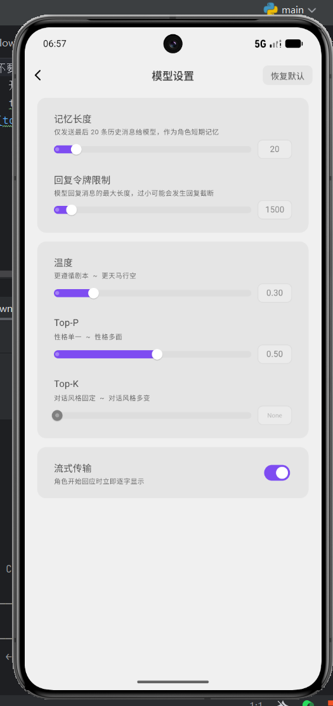

# tavo 设置推荐
在默认配置基础上的修改

## 更多-设置
### 聊天设置
创作者的功能全开：变量管理器，javascript 控制台,上下文日志

安全：tavojs 操作确认 全部关闭，也就是不需要确认
显示：隐藏模型思维链：开

### 高级渲染
高级渲染：开
javascript支持：自动
公式渲染：含内行$

### mcp 服务器
mcp 服务器：开

## 更多-api 连接
openai 协议
https://api.minimaxi.com/v1
Minimax-M3

## 更多- 模型设置

回复令牌限制：1500
记忆长度：20
温度：0.3
Top-P：0.5
Top-K：None
流式传输:开
同时建议安装 “toonflow_story_llm_optimization” 插件，在信息面板设置思考程度为：minimal