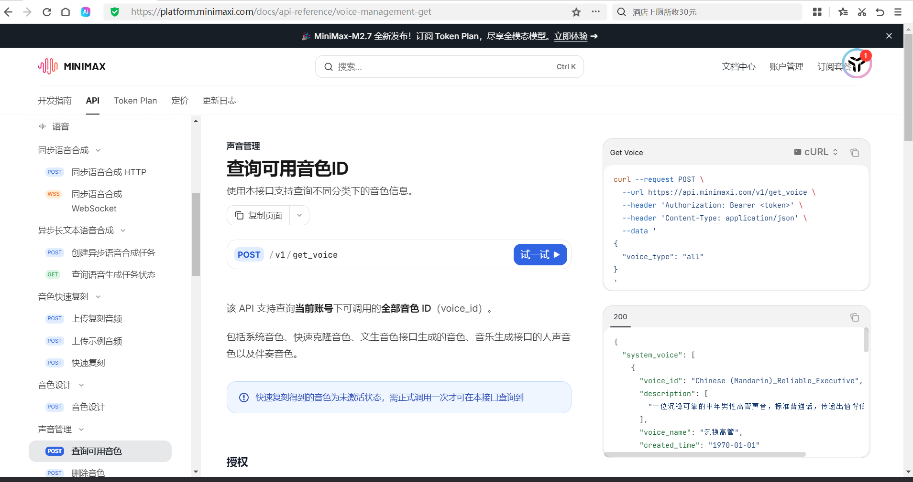

# no_modify
# MiniMax 语音接口集成
## 增加minimax 语音接口的支持
### 官网的文档：

语音设计
https://platform.minimaxi.com/docs/api-reference/voice-design-design

语音合成
https://platform.minimaxi.com/docs/api-reference/speech-t2a-http

语音克隆
https://platform.minimaxi.com/docs/api-reference/voice-cloning-clone

要求说明：
[README.md](../../../res/voice-presets/can_clone/README.md)

#### 语音设计接口
curl --location 'https://api.minimaxi.com/v1/voice_design' \
--header 'Authorization: Bearer xxx' \
--header 'Content-Type: application/json' \
--data '{
    "prompt": "讲述悬疑故事的播音员，声音低沉富有磁性，语速时快时慢，营造紧张神秘的氛围。",
    "preview_text": "夜深了，古屋里只有他一人。窗外传来若有若无的脚步声，他屏住呼吸，慢慢地，慢慢地，走向那扇吱呀作响的门…"
}'

#### 语音合成接口
curl --location 'https://api.minimaxi.com/v1/voice_design' \
--header 'Authorization: Bearer xxx' \
--header 'Content-Type: application/json' \
--data '{
    "prompt": "讲述悬疑故事的播音员，声音低沉富有磁性，语速时快时慢，营造紧张神秘的氛围。",
    "preview_text": "夜深了，古屋里只有他一人。窗外传来若有若无的脚步声，他屏住呼吸，慢慢地，慢慢地，走向那扇吱呀作响的门…"
}'

curl --location 'https://api.minimaxi.com/v1/t2a_v2' \
--header 'Authorization: Bearer <token>' \
--header 'Content-Type: application/json' \
--data '
{
  "model": "speech-2.8-hd",
  "text": "今天是不是很开心呀(laughs)，当然了！",
  "stream": false,
  "voice_setting": {
    "voice_id": "male-qn-qingse",
    "speed": 1,
    "vol": 1,
    "pitch": 0,
    "emotion": "happy"
  },
  "audio_setting": {
    "sample_rate": 32000,
    "bitrate": 128000,
    "format": "mp3",
    "channel": 1
  },
  "pronunciation_dict": {
    "tone": [
      "处理/(chu3)(li3)",
      "危险/dangerous"
    ]
  },
  "subtitle_enable": false
}
'

#### 克隆接口
[README.md](../../../res/voice-presets/can_clone/README.md)
- 上传文件
https://platform.minimaxi.com/docs/api-reference/file-management-upload
  - 上传文件，不标记用途
  curl --request POST \
    --url https://api.minimaxi.com/v1/files/upload \
    --header 'Authorization: Bearer <token>' \
    --header 'Content-Type: multipart/form-data' \
    --form purpose=t2a_async_input \
    --form file='@example-file'
  - 上传复刻音频，，标记为克隆用途，返回 file_id
  curl --request POST \
    --url https://api.minimaxi.com/v1/files/upload \
    --header 'Authorization: Bearer <token>' \
    --header 'Content-Type: multipart/form-data' \
    --form purpose=voice_clone \
    --form file='@example-file'


- 上传示例音频，标记为示例子用途，返回 file_id
curl --request POST \
  --url https://api.minimaxi.com/v1/files/upload \
  --header 'Authorization: Bearer <token>' \
  --header 'Content-Type: multipart/form-data' \
  --form purpose=prompt_audio \
  --form file='@example-file'


- 快速复刻
https://platform.minimaxi.com/docs/api-reference/voice-cloning-clone
使用本接口进行音色快速复刻。 复刻得到的音色若 7 天内未正式调用，则系统会删除该音色。
curl --request POST \
  --url https://api.minimaxi.com/v1/voice_clone \
  --header 'Authorization: Bearer <token>' \
  --header 'Content-Type: application/json' \
  --data '
{
  "file_id": 123456789,
  "voice_id": "<voice_id>",
  "clone_prompt": {
    "prompt_audio": 987654321,
    "prompt_text": "This voice sounds natural and pleasant."
  },
  "text": "A gentle breeze sweeps across the soft grass(breath), carrying the fresh scent along with the songs of birds.",
  "model": "speech-2.8-hd",
  "need_noise_reduction": false,
  "need_volume_normalization": false,
  "aigc_watermark": false
}
'
请求体
application/json
Voice clone request parameters

​
file_id
integer<int64>必填
待复刻音频的 file_id，通过文件上传接口获得（文档是https://platform.minimaxi.com/docs/api-reference/file-management-upload）
https://api.minimaxi.com/v1/files/upload 接口上传
上传的待复刻音频文件需遵从以下规范：

上传的音频文件格式需为：mp3、m4a、wav 格式
上传的音频文件的时长最少应不低于 10 秒，最长应不超过 5 分钟
上传的音频文件大小需不超过 20 mb
若使用该参数，则两个子属性（prompt_audio、prompt_text）都为必填项
​
voice_id
string必填
克隆音色的 voice_id，正确示例："MiniMax001"。用户进行自定义 voice_id 时需注意：

自定义的 voice_id 长度范围[8,256]
首字符必须为英文字母
允许数字、字母、-、_
末位字符不可为 -、_
voice_id 不可与已有 id 重复，否则会报错
​
clone_prompt
object
音色复刻示例音频，提供本参数将有助于增强语音合成的音色相似度和稳定性。若使用本参数，需同时上传一小段示例音频
上传的音频文件需遵从以下规范：

上传的音频文件格式需为：mp3、m4a、wav 格式
上传的音频文件的时长小于 8 秒
上传的音频文件大小需不超过 20 mb
Show child attributes

​
text
string
复刻试听参数，限制 1000 字符以内。模型将使用复刻后的音色朗读本段文本内容，并返回试听音频链接。
注：试听将根据字符数正常收取语音合成费用，定价与 T2A 各接口一致

语气词标签：仅当模型选择 speech-2.8-hd 或 speech-2.8-turbo 时，支持在文本中插入语气词标签。支持的语气词：(laughs)（笑声）、(chuckle)（轻笑）、(coughs)（咳嗽）、(clear-throat)（清嗓子）、(groans)（呻吟）、(breath)（正常换气）、(pant)（喘气）、(inhale)（吸气）、(exhale)（呼气）、(gasps)（倒吸气）、(sniffs)（吸鼻子）、(sighs)（叹气）、(snorts)（喷鼻息）、(burps)（打嗝）、(lip-smacking)（咂嘴）、(humming)（哼唱）、(hissing)（嘶嘶声）、(emm)（嗯）、(whistles)（口哨）、(sneezes)（喷嚏）、(crying)（抽泣）、(applause)（鼓掌）
​
model
enum<string>
复刻试听参数。指定合成试听音频使用的语音模型，提供 text 字段时必传此字段。可选项：

可用选项: speech-2.8-hd, speech-2.8-turbo, speech-2.6-hd, speech-2.6-turbo, speech-02-hd, speech-02-turbo, speech-01-hd, speech-01-turbo 
​
language_boost
enum<string>
是否增强对指定的小语种和方言的识别能力。默认值为 null，可设置为 auto 让模型自主判断。

可用选项: Chinese, Chinese,Yue, English, Arabic, Russian, Spanish, French, Portuguese, German, Turkish, Dutch, Ukrainian, Vietnamese, Indonesian, Japanese, Italian, Korean, Thai, Polish, Romanian, Greek, Czech, Finnish, Hindi, Bulgarian, Danish, Hebrew, Malay, Persian, Slovak, Swedish, Croatian, Filipino, Hungarian, Norwegian, Slovenian, Catalan, Nynorsk, Tamil, Afrikaans, auto 
​
need_noise_reduction
boolean默认值:false
音频复刻参数，表示是否开启降噪，默认值为 false

​
need_volume_normalization
boolean默认值:false
音频复刻参数，是否开启音量归一化，默认值为 false

​
aigc_watermark
boolean默认值:false
是否在合成试听音频的末尾添加音频节奏标识，默认值为 false

### 音色查询何删除
- 查询
curl --request POST \
  --url https://api.minimaxi.com/v1/get_voice \
  --header 'Authorization: Bearer <token>' \
  --header 'Content-Type: application/json' \
  --data '
{
  "voice_type": "all"
}
'

voice_type
enum<string>必填
希望查询音色类型，支持以下取值：

system: 系统音色
voice_cloning: 快速复刻的音色，仅在成功用于语音合成后才可查询
voice_generation: 文生音色接口生成的音色，仅在成功用于语音合成后才可查询
all: 以上全部
可用选项: system, voice_cloning, voice_generation, all 

返回的格式如下：
`{
  "system_voice": [
    {
      "voice_id": "Chinese (Mandarin)_Reliable_Executive",
      "description": [
        "一位沉稳可靠的中年男性高管声音，标准普通话，传递出值得信赖的感觉。"
      ],
      "voice_name": "沉稳高管",
      "created_time": "1970-01-01"
    },
    {
      "voice_id": "Chinese (Mandarin)_News_Anchor",
      "description": [
        "一位专业、播音腔的中年女性新闻主播，标准普通话。"
      ],
      "voice_name": "新闻女声",
      "created_time": "1970-01-01"
    }
  ],
  "voice_cloning": [
    {
      "voice_id": "test12345",
      "description": [],
      "created_time": "2025-08-20"
    },
    {
      "voice_id": "test12346",
      "description": [],
      "created_time": "2025-08-21"
    }
  ],
  "voice_generation": [
    {
      "voice_id": "ttv-voice-2025082011321125-2uEN0X1S",
      "description": [],
      "created_time": "2025-08-20"
    },
    {
      "voice_id": "ttv-voice-2025082014225025-ZCQt0U0k",
      "description": [],
      "created_time": "2025-08-20"
    }
  ],
  "base_resp": {
    "status_code": 0,
    "status_msg": "success"
  }
}`

- 音色删除
curl --request POST \
  --url https://api.minimaxi.com/v1/delete_voice \
  --header 'Authorization: Bearer <token>' \
  --header 'Content-Type: application/json' \
  --data '
{
  "voice_type": "voice_cloning",
  "voice_id": "yanshang11123"
}
'

## 概述

本项目已增加对 MiniMax 语音 API 的支持，包括：
- 语音合成（TTS）
- 语音设计（Voice Design）
- 语音克隆（Voice Cloning）

## API 接入点

### 1. 语音合成 TTS

**Endpoint:** `POST https://api.minimaxi.com/v1/t2a_v2`

**认证方式:** Bearer Token

```typescript
// 引入方式
import { synthesizeMiniMaxTtsBuffer } from "@/lib/miniMaxVoice";

// 使用示例
const result = await synthesizeMiniMaxTtsBuffer({
  apiKey: "your_api_key",
  model: "speech-02-hd",  // 或 speech-2.8-hd, speech-02-turbo 等
  text: "今天天气真好呀！",
  voiceId: "Chinese_Male_Qn",
  speed: 1.0,
  emotion: "happy",
  outputFormat: "hex",
  sampleRate: 32000,
});
// result.buffer 包含合成的音频数据
```

**支持模型:**
- `speech-2.8-hd` - 高质量版
- `speech-2.8-turbo` - 快速版
- `speech-02-hd` - 标准高清
- `speech-02-turbo` - 标准快速
- `speech-01-hd` / `speech-01-turbo`

**内置音色 ID:**
- 中文: `Chinese_Male_Qn`, `Chinese_Female_Qn`, `Chinese_Lyrical_Voice`
- 英文: `English_American_Male`, `English_American_Female`
- 日文: `Japanese_Female_Young`, `Japanese_Male_Young`

### 2. 语音设计 Voice Design

通过文本描述生成自定义音色。

**Endpoint:** `POST https://api.minimaxi.com/v1/voice_design`

```typescript
import { synthesizeMiniMaxVoiceDesignBuffer } from "@/lib/miniMaxVoice";

const result = await synthesizeMiniMaxVoiceDesignBuffer({
  apiKey: "your_api_key",
  prompt: "讲述悬疑故事的播音员，声音低沉富有磁性",
  previewText: "夜深了，古屋里只有他一人...",
});
// result.voiceId - 生成的音色ID
// result.buffer - 试听音频
```

判断为mimimax 就走角色发言选择的模型。使用这个minimax 专用的ai润色agent。

#### minimax 由设计到生成音色文件和根据文字试听要哪些步骤
1. 语音设计（生成音色）
"voice_id": "sv_xxx123",
2. 语音合成（使用音色朗读文本）
3. 生成一个可用于克隆参考的音色文件的步骤                                                                                                                                
[README.md](../../../res/voice-presets/can_clone/README.md)

### 3. 语音克隆 Voice Cloning
[README.md](../../../res/voice-presets/can_clone/README.md)
通过参考音频克隆音色。

**Endpoint:** `POST https://api.minimaxi.com/v1/voice_clone`

```typescript
import { cloneMiniMaxVoice } from "@/lib/miniMaxVoice";

const result = await cloneMiniMaxVoice({
  apiKey: "your_api_key",
  fileId: 123456789,  // 上传音频后获得的 file_id
  voiceId: "my_custom_voice",
  text: "这是克隆音色的试听文本",
  model: "speech-2.8-hd",
});
// result.voiceId - 克隆的音色ID
// result.demoAudio - 试听音频URL
```

## 配置方式

### 在设置中添加 MiniMax 语音配置

1. 进入「设置」→「语音模型」
2. 添加新配置，Manufacturer 选择 `minimax`
3. 填写 API Key
4. 选择模型（如 `speech-02-hd`）

### 数据库配置

在 `t_config` 表中添加记录：

```sql
INSERT INTO t_config (type, userId, manufacturer, model, apiKey, baseUrl, name, description)
VALUES ('voice', YOUR_USER_ID, 'minimax', 'speech-02-hd', 'YOUR_API_KEY', 'https://api.minimaxi.com', 'MiniMax TTS', 'MiniMax语音合成');
```

## 官方文档

- 语音设计: https://platform.minimaxi.com/docs/api-reference/voice-design-design
- 语音合成: https://platform.minimaxi.com/docs/api-reference/speech-t2a-http
- 语音克隆: https://platform.minimaxi.com/docs/api-reference/voice-cloning-clone
- 音色获取： https://platform.minimaxi.com/docs/api-reference/voice-management-get
- 音色删除：https://platform.minimaxi.com/docs/api-reference/voice-management-delete
- 上传文件（标记为复刻）：https://platform.minimaxi.com/docs/api-reference/voice-cloning-uploadcloneaudio
- 上传文件（标记为示例）：https://platform.minimaxi.com/docs/api-reference/voice-cloning-uploadprompt
- 上传文件（不标记）：https://platform.minimaxi.com/docs/api-reference/file-management-upload
