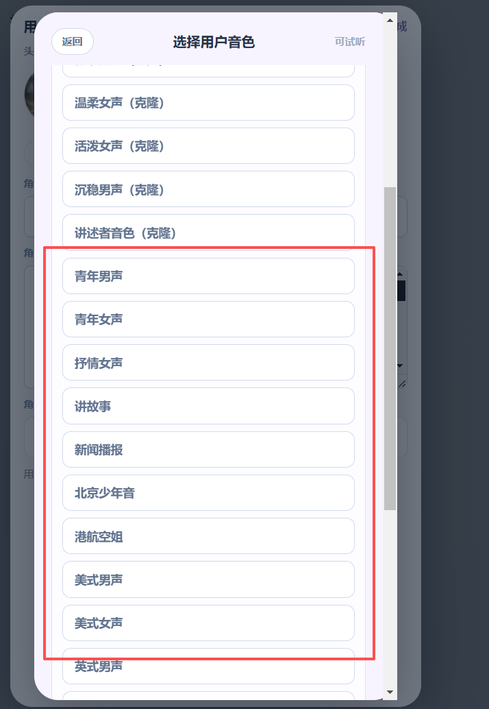
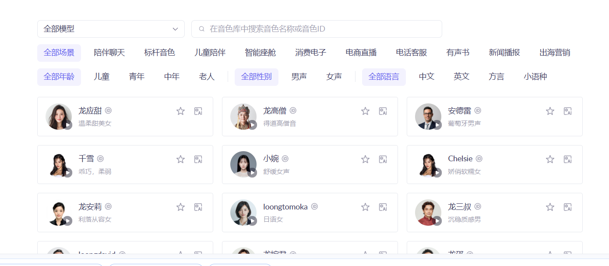

# no_modify
# 显示

# 阿里云预设音色列表的显示
直接把
[aliyun_voice_presets.json](../../../res/voice-presets/voice_list_system/aliyun_voice_presets.json)
的内容显示到 前端。name,voice,scene. 分页显示加搜索框得了。 选择了就用对应的模型去生成 试听和 音色文件得了。 

判断为当前的合成模型是阿里云合成语音模块(不区分cosyvoice 还是 Qwen)
就把
 这个区域隐藏
显示 阿里云的专用的可搜索预设音色列表

模型下拉框， 音色名称或音色id 的搜索框
场景选择
年龄选择 ，性别选择，语言选择
数据区域（分页10行）

后端读取[aliyun_voice_presets.json](../../../res/voice-presets/voice_list_system/aliyun_voice_presets.json)
接受前端发来的参数，处理数据后返回给前端

# minimax 官网音色列表的显示
判断为当前的合成模型是minimax 就显示minimax的专用音色列表

后端对接minimax的/v1/get_voices接口
 这个区域
这个区域前面是本项目的预设克隆音色
显示 minimax的专用音色列表
音色名称或音色id 的搜索框
数据区域（分页10行）

# 预设克隆音色列表
6 个业务标准音色：
标准男声（克隆）
标准女声（克隆）
温柔女声（克隆）
活泼女声（克隆）
沉稳男声（克隆）
讲述者音色（克隆）

这几个在模型专用的预设有音色前面显示。选择后走的是克隆通道。
特点是本项目的预设的用于克隆参考的音色列表。预设但是走克隆通道。

要求说明：
[README.md](../../../res/voice-presets/can_clone/README.md)